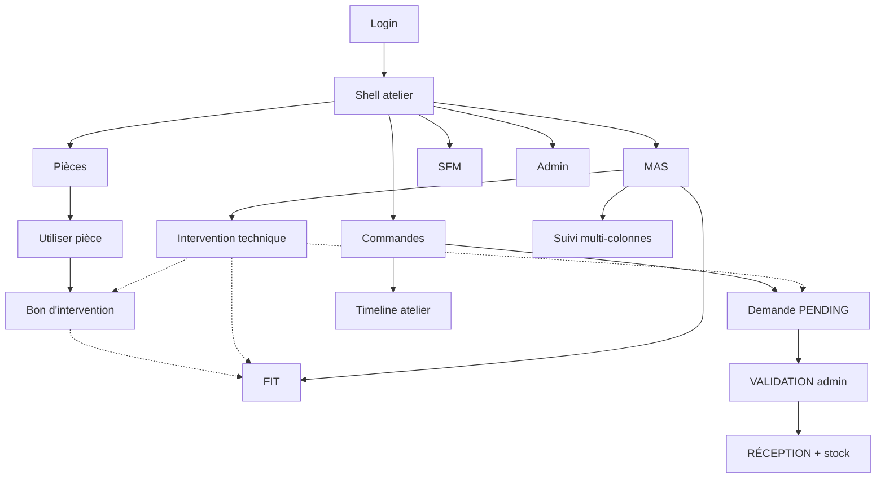

# DeviceManager

Application **mobile-first** de gestion d’atelier casino : inventaire des **pièces détachées**, suivi des **machines à sous (MAS)**, demandes de commande auprès des **SFM**, **bons d’intervention**, **interventions techniques** et fiches **FIT**.

Chaque utilisateur travaille dans le périmètre d’un **atelier** (multi-tenant : Groupe → Casino → Atelier).

---

## Structure du dépôt

```
DeviceManager/
├── backend/           ← API Spring Boot (+ Dockerfile)
├── frontend/          ← Angular 19 (+ inject-api-url pour Render)
├── docker/mysql/      ← image MySQL pour Render
├── sql/init.sql
├── render.yaml        ← Blueprint Render
├── RENDER.md          ← guide déploiement production
└── docker-compose.yml
```

---

## Stack

| Couche | Technologie |
|--------|-------------|
| Backend | Java 21, Spring Boot 3.5, JPA, Security JWT, Flyway, SpringDoc OpenAPI, Spring AI |
| Frontend | Angular 19, Material, Tailwind, driver.js (tutoriel), ExcelJS / jsPDF |
| Base | MySQL (Docker local ; Aiven Free en prod documenté) |
| Fichiers | Disque `/uploads` et/ou S3 (paramétrable) |
| Déploiement | Docker Compose, Blueprint Render (`RENDER.md`) |
| CI | GitHub Actions (tests, Checkstyle, SpotBugs, lint, build, CodeQL) |

---

## Rôles

| Rôle | Capacités |
|------|-----------|
| **ADMIN** | Accès métier complet sur les ateliers de son **groupe** ; sélecteur Casino → Atelier ; **Comptes** ; **Paramètres** (Setup) ; validation / réception / suppression des commandes |
| **TECHNICIEN** | Accès métier (pièces, MAS, SFM, bons, interventions techniques, FIT, commandes en création/consultation, timeline, IA si activée) ; atelier **figé** (préféré) ; pas d’admin ni de validation/réception commande |

---

## Multi-atelier

- Hiérarchie : **Groupe → Casino → Atelier**.
- Le front envoie l’en-tête **`X-Atelier-Id`** sur les appels authentifiés.
- Admin : peut changer d’atelier (même groupe) ; le préféré est mémorisé.
- Technicien : uniquement son atelier préféré (sélecteur en lecture seule).
- Toutes les données métier sont **scopées à l’atelier courant**.

---

## Concepts métier

### Bon d’intervention
Consommation de **pièces détachées** (décrémente le stock). Créé via **Utiliser une pièce détachée**. Numérotation : `BI-{atelier}-{année}-#####`. MAS optionnelle ; option **Associer à la FIT** (+ signatures).

### Intervention technique
Fiche **libre** sur une ou plusieurs MAS (**sans** consommation de stock). Une visite multi-MAS crée **une ligne par machine** (même `visite_groupe_id`). Liens optionnels : commande, bon, FIT.

### FIT (fiche inventaire / intervention technique)
Document type réglementaire lié à une MAS (1 FIT par atelier + MAS). Historique de **lignes** signées (admin + technicien).

### Liens optionnels

| De | Vers | Comment |
|----|------|---------|
| Bon | FIT | Case « Associer FIT » + MAS + signatures |
| Intervention technique | FIT | Case « Associer à la FIT » + signatures |
| Intervention technique | Bon / Commande | Sélecteurs filtrés sur les MAS choisies |
| Après IT | Bon ou ligne FIT | Modale post-enregistrement |

### Statut MAS

| Code | Libellé |
|------|---------|
| `UTILISEE` | Machine utilisée |
| `EN_RESERVE` | En réserve |
| `VENDUE` | Vendue |
| `DETRUITE` | Détruite |

---

## Parcours de l’application

### Connexion & session

| Route | Description |
|-------|-------------|
| `/login` | Connexion |
| `/change-password` | Changement forcé (comptes démo / flag) — min. 8 caractères |
| Shell | Nom · rôle · groupe · ville ; sélecteur atelier (admin) ; **Déconnexion** |
| Footer | **Tutoriel** (driver.js) · Confidentialité / RGPD |
| `/confidentialite` | Mentions RGPD |
| Header | **Assistant IA** (si activé) · Comptes / Paramètres (admin) |

Redirect par défaut après login : **Liste des pièces** (`/devices`).

---

### Menu Pièces

| Entrée | Route | Options / actions |
|--------|-------|-------------------|
| Liste (via logo) | `/devices` | Recherche ; détail / éditer / supprimer ; tuile stock à zéro → demande |
| Créer une pièce | `/devices/new` | Photos (caméra / galerie / crop), stock, obsolète, SFM, MAS, **scan IA étiquette**, documents PDF (**manuel / datasheet / notice**) |
| Éditer / détail | `/devices/:id/edit`, `/devices/:id` | Fiche complète + ouverture des PDF |
| Utiliser une pièce | `/devices/utiliser` | Lignes de consommation → **bon** ; motif / diagnostic / travaux ; MAS optionnelle ; **Associer FIT** + signatures |
| Bons d’intervention | `/devices/interventions` | Archive des bons |
| Éditer le stock | `/devices/stock` | Ajustement quantités ; regroupement SFM / marque ; **export Excel / PDF** |

---

### Menu Commandes

| Entrée | Route | Options / actions |
|--------|-------|-------------------|
| Nouvelle demande | `/order-request` | Création `PENDING` ; preview mails ; notif admin |
| Demandes en cours | `/order-requests` | Liste + **badge** pending ; **ADMIN** : valider → mails SFM, éditer quantités, réceptionner (+ stock), supprimer |
| Timeline | `/order-timeline` | Colonnes : **Commandes \| Bons \| Interventions techniques \| FIT \| Stock** (filtres) |

**Cycle commande** : `PENDING` → `VALIDATED` (admin) → `RECEIVED` (admin, stock +).

---

### Menu MAS

| Entrée | Route | Options / actions |
|--------|-------|-------------------|
| Liste des MAS | `/mas` | N°, socle, marque, déno, taux, **statut** ; CRUD |
| Nouvelle MAS | `/mas/new` | Formulaire 3 colonnes ; création marque / déno ; statut exclusif |
| Détail / édition | `/mas/:id`, `/mas/:id/edit` | Liens vers Suivi, FIT, édition |
| Suivi | `/mas/suivi` | Timeline filtrée MAS : **Bons \| Interventions techniques \| FIT** |
| Interventions techniques | `/mas/interventions` | Liste |
| Nouvelle IT | `/mas/interventions/new` | Multi-MAS ; motif / travaux ; liens commande & bon **filtrés** ; associer FIT ; **modale** ensuite (bon consommation ou ligne FIT) |
| Fiches FIT | `/mas/fit` | Liste |
| Nouvelle / détail FIT | `/mas/fit/new`, `/mas/fit/:id` | Création depuis MAS ; ajout de lignes signées |

---

### Menu SFM

| Route | Options / actions |
|-------|-------------------|
| `/sfm`, `/sfm/new`, `/sfm/:id`, `/sfm/:id/edit` | CRUD fournisseurs ; contacts (e-mails commande, technicien SFM réutilisable) |

---

### Administration (ADMIN)

| Entrée | Route | Options / actions |
|--------|-------|-------------------|
| Comptes | `/users`, `/users/new`, `/users/:id/edit` | Création ADMIN / TECHNICIEN ; atelier préféré obligatoire pour un technicien |
| Paramètres | `/setup` | Casinos & ateliers ; messagerie ; JWT / CORS ; S3 ; IA ; RGPD ; test e-mail ; **logs** applicatifs |

---

### Assistant IA

| Route | Options |
|-------|---------|
| `/ai` | Chat métier (si `AI_ENABLED`) ; scan d’étiquette aussi depuis le formulaire pièce |

---

## Modèle de données (aperçu)

### Pièce (`device`)
nom, référence, usage, date d’acquisition, stock, obsolete, photos, documents PDF (manuel / datasheet / notice), FK `sfm`, FK `mas`, marque.

### SFM
nom, contacts (téléphone, e-mail, flags réception commande / technicien SFM).

### MAS
numéro, socle, marque, déno, taux redistribution, **statut** (`UTILISEE` / `EN_RESERVE` / `VENDUE` / `DETRUITE`).

### Commande
message, statut, dates demande / validation / réception, lignes (pièce + quantité).

### Bon d’intervention
numéro, date, technicien, motif, travaux, lignes de pièces consommées, MAS optionnelle, lien FIT optionnel.

### Intervention technique
date, MAS, motif, travaux ; liens optionnels FIT / commande / bon ; `visite_groupe_id` multi-MAS.

### FIT
en-tête machine + lignes (date, socle, emplacement, motif, signatures admin & technicien, bon lié optionnel).

---

## Variables d’environnement

Toutes les configs sensibles sont dans les fichiers `.env` du **backend** uniquement.

| Environnement | Fichier | Activation |
|---------------|---------|------------|
| Développement | `backend/.env.development` | défaut |
| Production | `backend/.env.production` | `APP_ENV=production` |

Le frontend n’a accès à aucun secret (JWT, BDD, mail, S3, etc.).

---

## Lancer en local

```powershell
# MySQL
docker compose up -d

# Backend (charge .env.development automatiquement)
cd backend
$env:Path = "c:\Users\dell\device-manager\.tools\apache-maven-3.9.9\bin;" + $env:Path
mvn spring-boot:run

# Frontend
cd frontend
npm start
```

Production locale :

```powershell
cd backend
$env:APP_ENV="production"
mvn spring-boot:run
```

**Production Render** : voir [`RENDER.md`](./RENDER.md) — Blueprint `render.yaml` + MySQL Aiven Free.

| | |
|--|--|
| App | http://localhost:4200 |
| API | http://localhost:8080 |
| Swagger | http://localhost:8080/swagger-ui.html |
| Comptes seed | `admin` / `admin123` · `tech` / `tech123` |

---

## API (préfixes)

| Préfixe | Rôle |
|---------|------|
| `/api/auth` | login, refresh, logout, change-password |
| `/api/devices` | CRUD pièces + `PATCH /{id}/stock` |
| `/api/sfm` | CRUD SFM |
| `/api/mas` | CRUD MAS (+ marques / déno) |
| `/api/order-requests` | demandes (+ validate / receive admin) |
| `/api/interventions` | bons d’intervention |
| `/api/interventions-techniques` | interventions techniques |
| `/api/fit` | FIT (from-mas, lignes, signataires) |
| `/api/timeline` | événements agrégés (filtres `types`, `masId`) |
| `/api/ateliers` | ateliers / casinos / preferred |
| `/api/users` | comptes (admin) |
| `/api/setup` | paramètres + test mail |
| `/api/logs` | logs mémoire (admin) |
| `/api/ai` | status, chat, label-scan |
| `/api/privacy` | contenu RGPD (GET public) |
| `/uploads/**` | photos |

En-tête métier : **`X-Atelier-Id`**. Health : `/actuator/health`.

Architecture backend : `Controller → Service → Repository → MySQL` (+ DTO).

---

## Schéma des parcours (vue d’ensemble)


